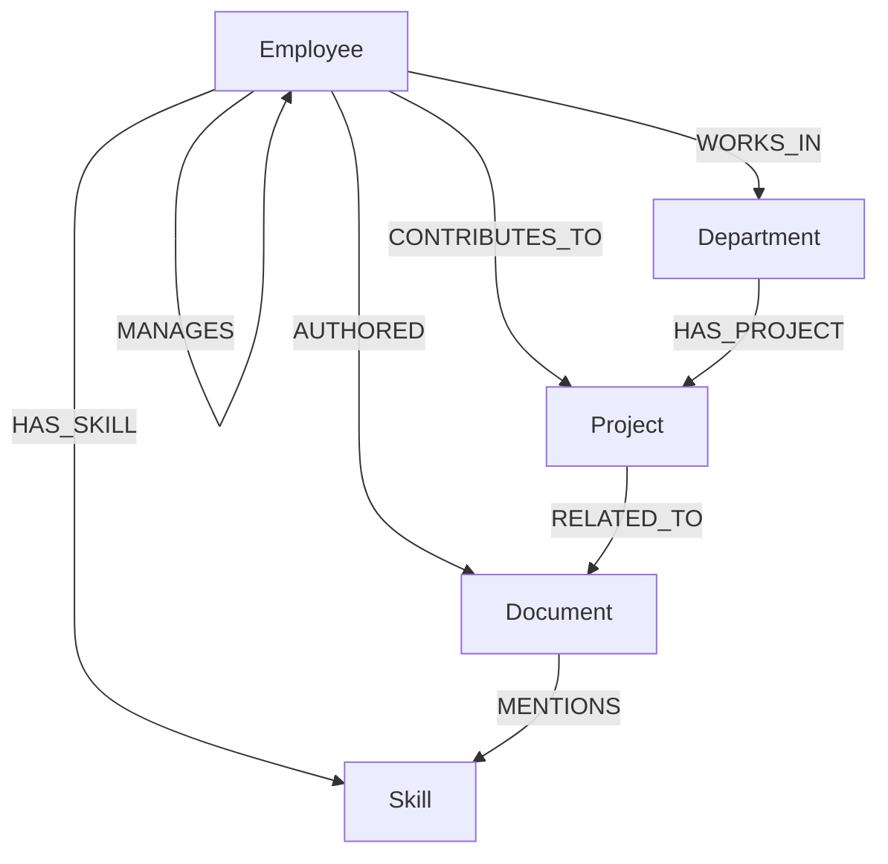

# Enterprise Knowledge Assistant

This repository implements an Enterprise Knowledge Assistant that uses a graph database to index employees, documents, skills, projects, and departments to enable rich relationship queries, recommendations, and visual exploration.

## Use Case

- Connect people, documents, skills, and projects to answer questions like:
  - Who in the company has experience with a given skill?
  - Which documents mention a topic and who authored them?
  - Find the shortest collaboration path between two employees.
  - Recommend collaborators for a project based on complementary skills and shared history.

This assistant powers internal knowledge discovery, onboarding, expertise location, and cross-team analytics.

## Why a graph database?

- Graph databases (like Neo4j / CognoDB) model entities and relationships natively, making it simple and efficient to traverse connections and compute relationship-based queries.
- Common graph advantages for this project:
  - Fast traversal for multi-hop queries (e.g., shortest collaboration paths).
  - Flexible schema for evolving ontologies (adding new relationship types or node labels without costly migrations).
  - Simple queries for recommendations and pattern matching.

## Data Model (diagram)

Below is a compact representation of the data model. Nodes: `Employee`, `Department`, `Document`, `Skill`, `Project`.



Save or render this Mermaid block using a viewer that supports Mermaid (many Markdown renderers do).

## Main queries (Cypher) and explanations

- Find employees with a skill (exact match):

```cypher
MATCH (e:Employee)-[:HAS_SKILL]->(s:Skill {name: $skill})
RETURN e { .name, .title, .email } AS employee
ORDER BY e.name
```

Explanation: Matches employees connected to a `Skill` node and returns lightweight employee objects.

- Top skills across the company:

```cypher
MATCH (:Employee)-[:HAS_SKILL]->(s:Skill)
RETURN s.name AS skill, count(*) AS holders
ORDER BY holders DESC
LIMIT 20
```

Explanation: Aggregates skills by how many employees have them.

- Shortest collaboration path between two employees:

```cypher
MATCH (a:Employee {id: $idA}), (b:Employee {id: $idB})
CALL apoc.algo.shortestPath(a, b) YIELD path
RETURN path
```

Explanation: Uses shortest path to show connections (requires APOC or built-in shortestPath depending on DB flavor). Useful to find introductions or collaboration chains.

- Documents that mention a skill and their authors:

```cypher
MATCH (d:Document)-[:MENTIONS]->(s:Skill {name: $skill})
OPTIONAL MATCH (author:Employee)-[:AUTHORED]->(d)
RETURN d.title AS document, collect(author.name) AS authors
ORDER BY d.title
```

Explanation: Finds documents referencing a skill and lists their authors.

- Recommend potential collaborators for an employee (example):

```cypher
MATCH (me:Employee {id: $meId})-[:HAS_SKILL]->(s:Skill)<-[:HAS_SKILL]-(other:Employee)
WHERE NOT (me)-[:WORKS_IN]->()<-[:WORKS_IN]-(other) OR me.department <> other.department
RETURN other, collect(distinct s.name) AS sharedSkills, size((me)-[:HAS_SKILL]->()) AS mySkillCount
ORDER BY size(sharedSkills) DESC
LIMIT 10
```

Explanation: Finds other employees who share skills, ranks by number of shared skills, and can be tuned to prefer cross-department recommendations.

## Setup and run instructions

Prerequisites:

- Node.js (LTS) and `npm` installed.
- A CognoDB or Neo4j-compatible graph database instance (cloud or self-hosted).

1) Create a CognoDB instance

- Sign up or log in to your CognoDB (or Neo4j) provider and create a new database instance.
- Note the connection details: Bolt URI (e.g. `bolt://<HOST>:7687` or `neo4j+s://<HOST>`), username, and password.

2) Configure backend connection

- The backend reads configuration from environment variables. Create a `.env` file in the `backend` folder with the following values:

```
NEO4J_URI=neo4j+s://<HOST>
NEO4J_USER=neo4j
NEO4J_PASSWORD=your_password_here
PORT=4000
```

- Alternatively, open [backend/config/neo4j.js](backend/config/neo4j.js) and update the connection settings directly.

3) Install and run the backend

```
cd backend
npm install
# seed the database (optional but recommended)
node seed/seed.js
# start the backend
npm start
```

4) Install and run the frontend

```
cd frontend
npm install
npm run dev
```

5) Verify

- Open the frontend in your browser (Vite usually serves on `http://localhost:5173` by default).
- Use the backend API endpoints to confirm the database connection (see `server.js` and `testConnection.js` in `backend`).

Notes about seeding

- The repository contains a seed script at `backend/seed/seed.js`. Running it will create sample nodes and relationships used by the UI.
- If you have an empty database, run `node seed/seed.js` before using the UI.

## CognoDB specifics

- CognoDB-compatible instances accept the same Bolt/HTTP URIs and drivers as Neo4j in most setups. If your provider requires a CA certificate or secure connection options, update `backend/config/neo4j.js` accordingly or provide the required TLS configuration in environment variables.

## Screenshots of the UI

Place application screenshots in `frontend/public/screenshots/` and reference them here. Example markdown to add after placing files:

```


```

I have added placeholder instructions; add your exported PNGs or JPGs to the `frontend/public/screenshots/` folder to make them appear in this README.

## Where to look in the code

- Backend graph logic and models: [backend/models](backend/models)
- Controllers and routes (API surface): [backend/controllers](backend/controllers) and [backend/routes](backend/routes)
- Frontend UI: [frontend/src](frontend/src)
- Seed data: [backend/seed/seed.js](backend/seed/seed.js)

## Demo Link
Demo Live :https://enterprise-knowledge-assistant-1-i3g4.onrender.com/

## Deployment (Render) notes

- Frontend (Static site): When deploying the frontend as a static site on Render you must rewrite all non-file requests to `index.html` so client-side routes work on refresh. Add this rewrite in the Render dashboard (Site → Settings → Rewrites) with a rule like:

  - Source: `/*`
  - Destination: `/index.html`
  - Status: `200`

- A `_redirects` file has been added to `frontend/public/_redirects` containing `/* /index.html 200`. Vite copies files from `public` into the `dist` build output; if Render doesn't use `_redirects` automatically, add the rewrite rule in the dashboard.

- Backend (Web Service): If you serve the built frontend from the Express backend (deploy backend as a Web Service), ensure the frontend is built into `frontend/dist` during the build step and that the server start command runs after build. The backend includes a guarded SPA catch-all that serves `index.html` for non-API routes when `frontend/dist` exists.

- Environment: Set `VITE_API_URL` for the static frontend to point to your backend (for example `https://<your-backend>.onrender.com/api`). This ensures API calls like `api.get('/employees')` target the correct backend path.


